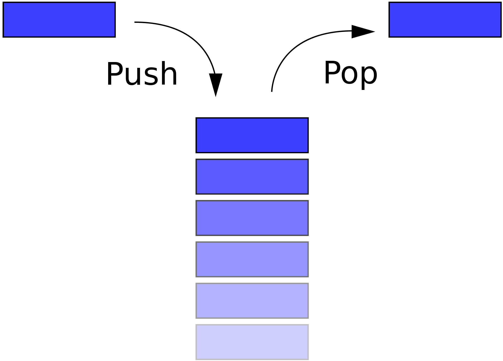

# Discussion Questions

## Linear Data Structures 

Please read through these before class, and come prepared to have a meaningful discussion with your peers

For each question we'll discuss in small groups, then as a big group

## General

1. Introduce yourself to your group!
1. What questions or comments do you have after watching the video lectures?
1. What about JavaScript makes analysis difficult? What can we do to deal with this?
1. How would you iterate through a linked list _recursively_?
    - What are the time and space complexities of recursive iteration?
1. We say two data structures are _equivalent_ if they contain the same records in the same order.
    - How would you check if two queues are equivalent?
    - Is it possible for two queues of the same class with a different internal structure to be equivalent?
1. How would you _serialize_ a linked list - that is, turn it into a string of characters that could be saved to a file or sent over the network? 
    - What assumptions do you need to make?
    - What are the space and time complexity of serialization?
    - What does _deserialization_ (turning a string back into a linked list) look like?
1. Work with your group to design an array-based queue that doesn't leak memory. How does it work? What constraints does it have?
1. The video mentions that array insert is amortized `O(1)`, even though allocating a new buffer and copying existing elements is `O(n)`. How does this work?

## Stacks

A stack similar to a queue in many ways. You can insert and remove elements, and elements are stored and removed relative to the order they were inserted.

The big difference is a stack removes elements in the opposite order of a queue. With a queue you always get the oldest element, but with a stack you get the youngest.

### Queue

### Stack

### Stack Facts

- Stacks are linear (elements are stored in order)
- Insert is called `push`
- Remove is called `pop`
- `pop` removes elements in first-in last-out order (youngest first)

### Questions

1. How would you implement a stack with a linked list?
    1. What are the time and space complexities of `push` and `pop`?
    1. Do you still need a doubly-linked list?
1. How would you implement a stack with an array?
    1. What are the time and space complexities of `push` and `pop`?
    1. Does an array-based stack leak memory like an array-based queue?

## Priority Queues

Imagine that each element in our queue data structure comes with a priority. When we dequeue an element, instead of the oldest element we want to get the one with the highest priority. If there's a tie then the oldest tied element should be dequeued. Iteration should also proceed in priority order.

We might call such a data structure a **priority queue**.

Priority queues are useful in all sorts of real-world situations, including process scheduling and pathfinding. They're so important that we'll dedicate an entire week to them later in the course!

Based on what we know now, how might we implement a priority queue? What would the time and space complexities of various operations be?

## Extra

These questions aren't very practical, but they are interesting! Borrowed from _Introduction to Algorithms_ by Cormen et al.

1. Explain how to implement a queue using two stacks. Analyze the time complexity of enqueue and dequeue.
1. Explain how to implement a stack using two queues. Analyze the time complexity of push and pop.